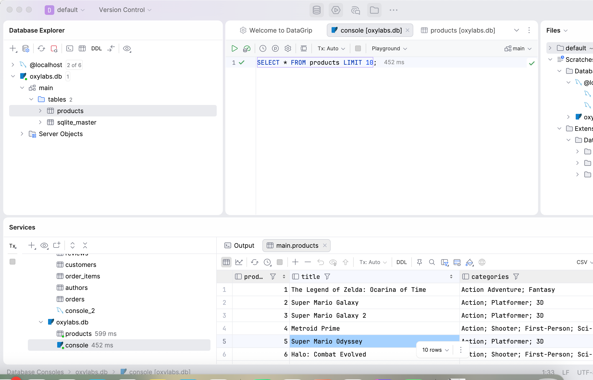
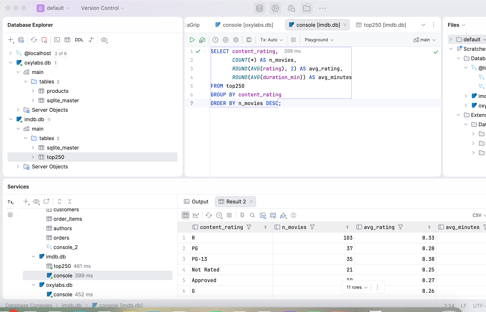
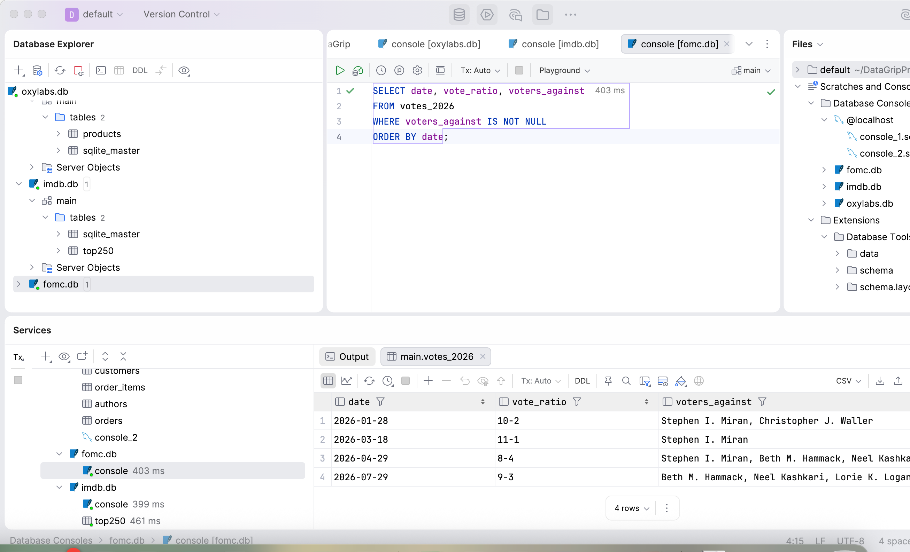

# Web Scraping Practice

Reproducing the Oxylabs scraping tutorial, improving it, scraping two real websites (IMDb Top 250 and the 2026 FOMC statements), and saving the results to SQL. Each part has its own notebook, CSV and SQLite database.

| Folder | Project | Output |
|---|---|---|
| `reproduction/` | Oxylabs tutorial + improvements | `products_10pages.csv`, `products_10pages_clean.csv`, `oxylabs.db` |
| `realworld/` | IMDb Top 250 | `imdb_top250.csv`, `imdb.db` |
| `realworld-2/` | FOMC 2026 statements | `fomc_2026_votes.csv`, `fomc.db` |

## How the three sites differ

| | Oxylabs sandbox | IMDb Top 250 | FOMC statements |
|---|---|---|---|
| Data | Product cards | Movie list | Paragraphs of text |
| Where it sits | `div.product-card`, 32 per page | JSON-LD block in the page | `<p>` tags in `div#article`, no classes |
| Pages | `?page=N` | One page | Calendar page → one page per statement |
| Anti-scraping | None | AWS WAF + CAPTCHA | None |
| Main difficulty | Ratings drawn by JavaScript | Getting into the page | Format changed mid-year |
| Tool used | Selenium | Selenium + JSON | requests + regex |

---

## 1. Oxylabs tutorial

Ran the tutorial, then extended it from 2 fields to 8 and from 1 page to 10.

**Challenges**

- **Blog-title selector no longer works.** All four tutorial methods (BeautifulSoup, CSS select, lxml, Selenium) returned 0 titles with no error. The page loads fine, but the class `e1dscegp1` isn't in the HTML anymore. Inspecting the page showed the new class `e1ot91pl0`, which works again. These class names are auto-generated and change when the site is rebuilt, so for the products I used readable class names like `title` and `price-wrapper` instead.
- **requests was faster, but every rating was 0.** requests and Selenium both found 32 products and requests was faster, so I used it for 10 pages. Then all 320 ratings came back as 0: in the raw HTML the rating `div` is empty, because the stars are drawn by JavaScript. I had only compared the number of products, not their fields. I switched to Selenium.
- **The notebook itself.** I reused variable names (`soup`, `df_all`) for different data, so some checks read the wrong data, and cells failed with `NameError` after a restart. I gave each version its own name and used Restart → Run All.

**Result:** 320 products, 8 fields. One dict per product (instead of two lists joined by position), prices converted to numbers, missing elements return `None`. Cleaned: no duplicates, removed line breaks and stray characters.

---

## 2. IMDb Top 250

**Challenges**

- **Blocked by a firewall.** requests got status 202 and an empty page. Printing the response headers showed `x-amzn-waf-action: challenge`, which comes from AWS WAF (Amazon's firewall). requests can't pass that check, so I switched to Selenium.
- **CAPTCHA.** IMDb showed an image CAPTCHA to the automated browser. I solved it by hand and didn't try to bypass it.
- **Outdated selector.** The page had 250 movie items, but the usual selector `h3.ipc-title__text` only matched 3 section headings. I saved the HTML and found a JSON-LD block with all 250 movies, so I parsed that instead. It's simpler and more stable than class names.

**Result:** 250 movies, 8 fields (rank, title, rating, votes, genre, content rating, minutes, URL). 6 non-US movies have no content rating and are kept as missing.

**Note:** IMDb's terms don't allow scraping. This was a one-time learning exercise; for real use, IMDb's official datasets would be the right source.

---

## 3. FOMC 2026 statements

Extracted the vote result and dissenters from the 6 statements released in 2026.

**Challenges**

- **Garbled text.** `3-1/2` showed up as `3â1/2` and some words were stuck together. Fixed by setting the encoding to UTF-8 and using `get_text(" ")`.
- **First parser crashed.** I built it from the January statement only. It crashed on June and September because the format changed: January–April list "Voting for / Voting against" with names, June–September give a tally ("by a 12 - 0 vote") instead. I searched every paragraph for "vot" to see all the wordings, then wrote one rule per format.
- **Counting names.** "Vice Chair" looked like a name to my pattern, and April had two groups of dissenters with different reasons. I removed titles and reasons before counting.

**Check:** every meeting adds up to 12 voters.

| Meeting | Vote | Voting against |
|---|---|---|
| Jan 28 | 10-2 | Miran, Waller |
| Mar 18 | 11-1 | Miran |
| Apr 29 | 8-4 | Miran, Hammack, Kashkari, Logan |
| Jun 17 | 12-0 | none |
| Jul 29 | 9-3 | Hammack, Kashkari, Logan |
| Sep 16 | 12-0 | none |

**Finding:** Miran dissented January–April, wanting a cut. Hammack, Kashkari and Logan started dissenting in April and pushed for a hike in July. In September the vote to raise rates was unanimous.

---

## 4. SQL

Each notebook saves its final data to a SQLite table in its own folder. The three datasets are unrelated, so each project has its own database. I opened them in DataGrip and ran one query each.

**Oxylabs** (`products`, 320 rows): number of products and average price by rating

> 📷 Screenshot

**IMDb** (`top250`, 250 rows): number of movies and average rating by content rating

> 📷 Screenshot

**FOMC** (`votes_2026`, 6 rows): meetings with at least one dissent

> 📷 Screenshot



---


## How to run

```bash
python3 -m venv .venv
source .venv/bin/activate
pip install -r requirements.txt
```

Open a notebook and choose the `.venv` kernel. Oxylabs and IMDb open Chrome through Selenium; IMDb may ask for a CAPTCHA.
